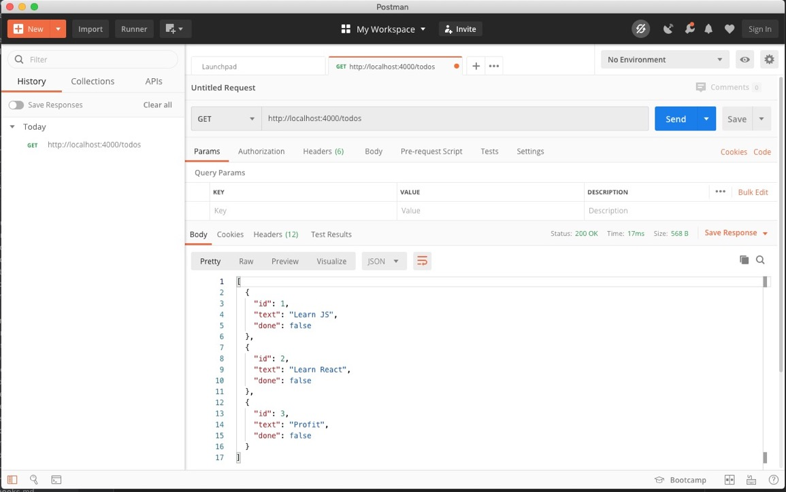

## Network Calls

### REST endpoints

* **RE**presentational **S**tate **T**ransfer
* Envisioned in 2000 for a Ph.D. thesis [(link)](https://www.ics.uci.edu/~fielding/pubs/dissertation/top.htm)
* Core principles:
  * Client-server architecture
  * Stateless
  * Cacheable
  * Uniform interface

### REST endpoints

* Describe routes by the **resources** involved
* Route w/o an ID refers to the "collection"
  * `/todos`
  * `/artists`
  * `/articles`
* Route w/ an ID refers to a specific entity
  * `/todos/42`
  * `/artists/33`
  * `/articles/my-blog-article`

### REST endpoints

HTTP requests have a **method** to describe intent

* GET - read
* POST - create
* PUT - update
* DELETE - delete

Links to dive deeper:

[(Link 1)](https://www.codecademy.com/articles/what-is-rest)
[(Link 2)](https://www.restapitutorial.com/lessons/restfulresourcenaming.html)
[(Link 3)](https://www.infoq.com/articles/rest-introduction/)
[(Link 4)](https://chelseatroy.com/2018/08/01/api-design-part-1-before-there-was-rest)

### REST endpoints

**GET** goes to collection OR member

```
$ curl -X GET http://localhost:4000/todos

[
  { "id": 1, "text": "Learn JS", "done": false },
  { "id": 2, "text": "Learn React", "done": false },
  ...
]

$ curl -X GET http://localhost:4000/todos/1

{ "id": 1, "text": "Learn JS", "done": false }
```

### REST endpoints

**POST** goes to the collection

```
$ curl -d '{ "text": "Practice REST", "done": false }' \
  -H "Content-Type: application/json" \
  -X POST http://localhost:4000/todos
```

Returns the newly created member:

```
{
  "id": 4,
  "text": "Practice REST",
  "done": false
}
```

### REST endpoints

**PUT** goes to member

```
$ curl -d '{ "text": "Practice REST", "done": true }' \
   -H "Content-Type: application/json" \
   -X PUT http://localhost:4000/todos/4
```

Returns the newly updated member:

```
{
  "id": 4,
  "text": "Practice REST",
  "done": true
}
```

### REST endpoints

**DELETE** goes to member

```
$ curl -X DELETE http://localhost:4000/todos/4

{}
```

### Query Parameters

* Key-value pairs passed on an HTTP request
* Commonly used to specify additional behavior of GET requests
* Query params come at end of URL after `?`
* Multiple values joined with `&`

```
GET /todos?page=7
GET /calendar?locale=en&date=2020-07-27
```

### Tinkering with Endpoints

`curl` is fun and all, but...

More positive UI: **Postman**

### Tinkering with Endpoints



### HTTP Requests in JavaScript

Bare metal: `new XMLHttpRequest`

More discussion for the curious: [(link)](https://javascript.info/xmlhttprequest)

### HTTP Requests with `axios`

**axios** is a promise-based library for HTTP requests.

Much better DX than `XMLHttpRequest`

```
yarn add axios
```

### A Quick Aside

* People got aboard the `fetch` hype train back in 2017 or so
* Similar functionality
* Native web API
* DX not quite as nice as `axios`

### HTTP Requests with `axios`

```javascript
axios.get('/todos')
axios.get('/todos/1')
axios.post('/todos', { text: 'Learn axios', done: false })
axios.put('/todos/4', { text: 'Learn axios', done: true })
axios.delete('/todos/4')
```

### Handling Responses

Response structure:

```javascript
{
  request: {/* ... */}, // your request
  response: {
    data: [], // data from the server
    status: 200, // HTTP status
    headers: {} // response headers
  }
}
```

### Handling Responses

```javascript
// Promise-based
axios.get('/todos', { params: { page: 2 } })
  .then((res) => {
    console.log(res.data) // [...]
  })

// Async-await
const { data } = await axios.get(
  '/todos', 
  { params: { page: 2 } }
)
console.log(data) // [...]
```

### Handling Errors

```javascript
try {
  const { data } = await api.get('/todos/invalidId')
} catch (error) {
  if (error.response) {
    // The request was made and the server responded with 
    // a status code that falls out of the range of 2xx
    console.log(error.response.data)
    console.log(error.response.status)
  } else {
    // Something happened in setting up the request 
    // that triggered an Error
    console.log('Error', error.message)
  }
}
```

### Handling Errors

* Network errors **do not return a response**

```javascript
try {
  const { data } = await api.get('/todos/invalidId')
} catch (error) {
  // this will trigger another JS error on network errors
  // trying to read `data` of undefined
  console.log(error.response.data)
}
```

### Handling Errors

Checking for network errors:

```javascript
export const isAxiosNetworkError = (e) => (
  !e.response && e.message === 'Network Error'
)
```

### Configuration

```javascript
import axios from 'axios'

// create the instance
const api = axios.create({ 
  // specify a base URL other than current domain
  baseURL: 'http://localhost:4000' 
})

// adding auth
api.defaults.headers.common['Authorization'] = AUTH_TOKEN

// making calls with your API instance
api.get(/* ... */)
```

### Configuration

Other functionality you can set:

* Transform incoming/outgoing payloads
* Add query params
* Add cookies, set headers
* Specify response type / response encoding
* Cancel a request

Much of it you will learn on a need to know basis.

Docs: [(link)](https://github.com/axios/axios)

### Exercise

Turn on your local DB server:

```
$ cd src
$ yarn db
```

1. Practice GET, POST, PUT, DELETE using Postman
1. Practice GET, POST, PUT, DELETE using `axios`
1. Practice using query params [(docs link)](https://github.com/typicode/json-server#filter)
  * Request the first 2 todos
  * Request only uncompleted todos
  * Request the first uncompleted todo
