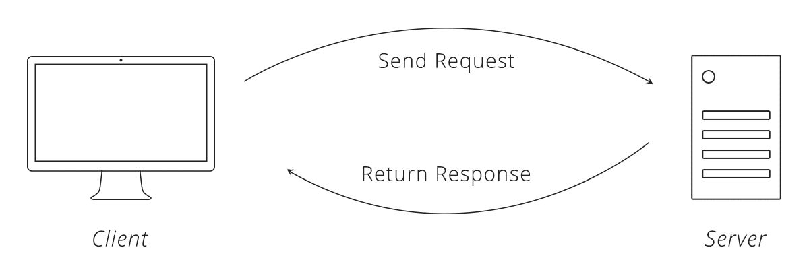

## Websockets

### Typical HTTPS requests

- Request / response cycle
- Always initiated by the client
- Server can only respond once

### Typical HTTPS requests



### Getting updates from server

- Polling
- "Long polling"
- Websockets

### Websockets

- Upgrades regular TCP connection to "duplex"
- Creates a two-way communication channel
- Each sends messages whenever they want
- Not subject to CORS

### Security

- Encrypt traffic and confirm identity
- Never execute foreign JS

### Websockets (client)

```javascript
const ws = new WebSocket('ws://localhost:3030/')

// connection opened
ws.onopen = () => {}

// connection closed
ws.onclose = () => {}

// error occured
ws.onerror = () => {}

// message received
ws.onmessage = ({ data }) => {}

// send message
ws.send('PING')

// close connection
ws.close()
```

### Websockets (server)

```javascript
// `ws` is a popular implementation of websockets
const WebSocket = require('ws')
const wss = new WebSocket.Server({ port: 3030 })

// new connection received
wss.on('connection', (ws, req) => {
  // send message
  ws.send('Welcome!')

  // on disconnect
  ws.on('close', () => {})
})
```

### Demo

- Visit http://localhost:3000/js/browser/websockets/demo/

### Authenticating

- You can send query params along with the WS connection:

```javascript
ws = new WebSocket(`ws://localhost:3030/?user=${user}`)
```

- You could use an auth key for real security
- Read the query params on the WS side:

```javascript
const url = require('url')
wss.on('connection', (ws, req) => {
  const user = url.parse(req.url, true).query.user
  // check if user is valid...
})
```

### Communicating with other clients

You can access other connected clients: `wss.clients`

```javascript
wss.clients.forEach(client => {
  client.send('Hello')
})
```

### Communicating with other clients

WS will error if you try to `send` to a closed client:

```
Error: WebSocket is not open: readyState 3 (CLOSED)
```

So check for readiness before sending:

```javascript
wss.clients.forEach(client => {
  if (client.readyState === WebSocket.OPEN) {
    client.send(message)
  }
})
```

### Communicating with other clients

You can also skip yourself when iterating across clients:

```javascript
const sendToClients = (ws, message) => {
  wss.clients.forEach(client => {
    if (client !== ws) {
      // ...
    }
  })
}
```

### Exercise


