## Console Debugging

### Console Debugging

- Everyone knows `console.log`
- But there's a lot more out there!

\columnsbegin \column{.5\textwidth}

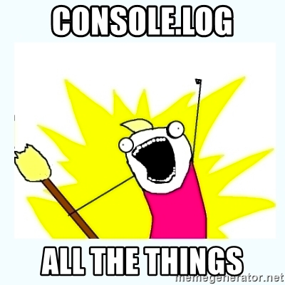

\column{.5\textwidth}
\columnsend


### Console Debugging

- `console.log` shows object *at time of expansion*

\columnsbegin \column{.5\textwidth}

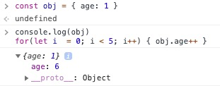

\column{.5\textwidth}
\columnsend


### console.table

- Prettier printouts of your objects and arrays

```javascript
const people = [
  { id: 1, firstName: 'Andrew', lastName: 'Smith' },
  { id: 2, firstName: 'Billy', lastName: 'Joel' }
]
console.table(people)
```

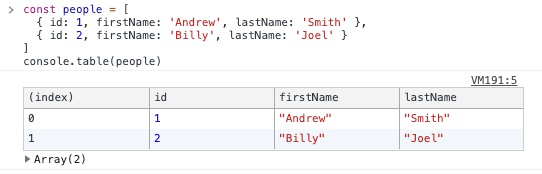

### console.dir

- Basically the same as `console.log`, you can ignore

### console.assert

- Print out an error when assertion fails
- `console.assert(assertion, 'message')`

\columnsbegin \column{.5\textwidth}

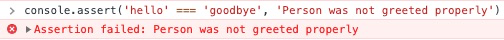

\column{.5\textwidth}
\columnsend

### console.count

- Increment a counter
- `console.count('label')`

\columnsbegin \column{.5\textwidth}

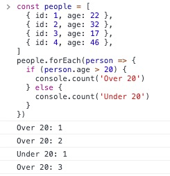

\column{.5\textwidth}
\columnsend

### console.time

- A handy stopwatch for timing functions
- `console.time(label)` - start 
- `console.timeLog(label)` - log current time
- `console.timeEnd(label)` - stop

\columnsbegin \column{.5\textwidth}

Without a label:

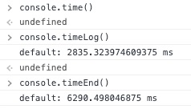

\column{.5\textwidth}

With a label:

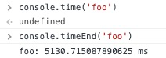

\columnsend

### console.trace

- Print out a stack trace from a location in code
- `console.trace(label)`

\columnsbegin \column{.5\textwidth}

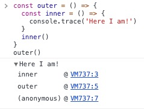

\column{.5\textwidth}
\columnsend

### console.group

- Create nested printouts
- `console.group()` / `console.groupEnd()`
- `console.groupCollapsed()` / `console.groupEnd()` - start with them collapsed

\columnsbegin \column{.5\textwidth}

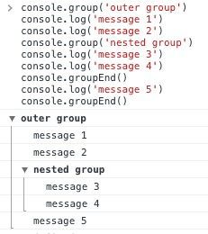

\column{.5\textwidth}

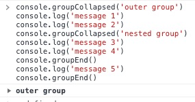

\columnsend

### Styling

- Add a `%c` into a string to start styling with CSS
- Then provide the CSS string as a second argument
- This uses console interpolation

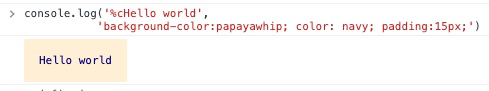

### Styling

- Can do this multiple times
- Pass in an empty string to reset styling

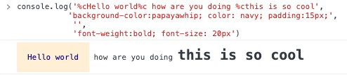

### Styling

\columnsbegin \column{.5\textwidth}

- This is how sites like Google and Facebook warn against XSS attacks

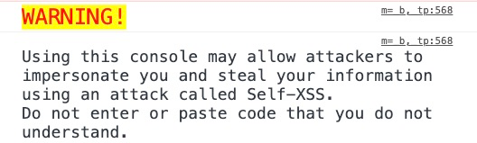

\column{.5\textwidth}

- You could also use it for recruiting!

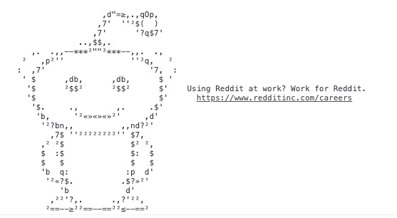

\columnsend

### Emoji

- Not actually debugging related, but very important!
- Use the Unicode Emoji List ([link](https://unicode.org/emoji/charts/full-emoji-list.html))
- Put into `String.fromCodePoint(...)`

\columnsbegin \column{.5\textwidth}

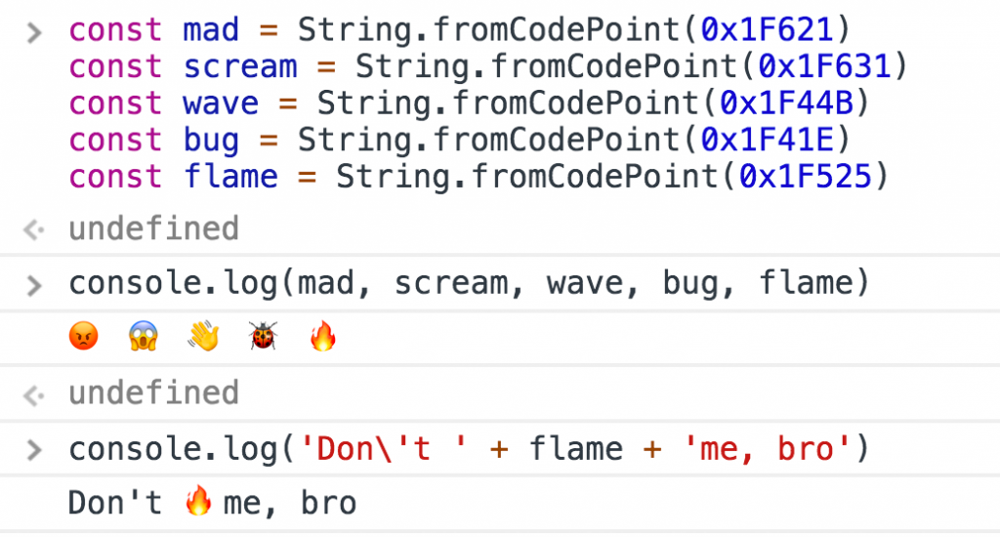

\column{.5\textwidth}
\columnsend

- Hot tip: Alfred users can use the Alfred Emoji pack ([Github link](https://github.com/jsumners/alfred-emoji))
- Instructions ([link](http://joelcalifa.com/blog/alfred-emoji-snippet-pack/))

### Exercise

Practice working with:

- `console.table`
- `console.assert`
- `console.count`
- `console.time`
- `console.trace`
- `console.group`
- Styling with `%c`
