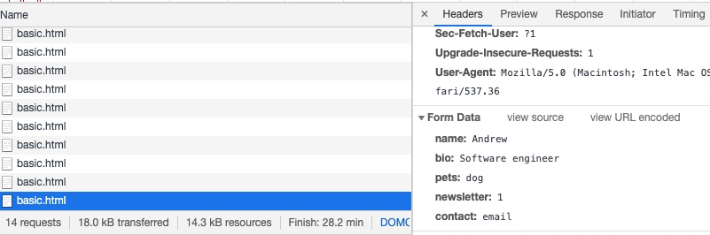
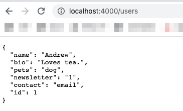
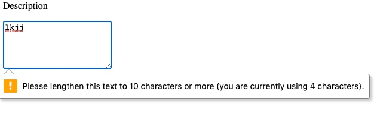
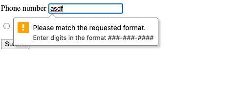

## Forms

### Forms

* Because what website can exist without one?
* Contains interactive controls for submitting information

```javascript
<form>
  {/* ... */}
</form>
```

* Common form elements
    * Examples?

### Form Inputs

```html
<form>
  Short text:
  <input type="text" name="name">

  Long text:
  <textarea rows="3" name="bio"></textarea>

  <input type="submit" value="Submit" />
  <button type="submit">Also a submit button</button>
</form>
```

### Form Inputs

Dropdown (select)

```javascript
<select name="pets">
  <option value="">Which one is better?</option>
  <option value="dog">Dog</option>
  <option value="cat">Cat</option>
</select>
```

### Form Inputs

Check boxes

```javascript
<input type="checkbox" name="newsletter" 
       value="1" id="subscribe">
<label for="subscribe">Sign up for newsletter</label>
```

### Form Inputs

Radio buttons

```javascript
<input type="radio" name="contact" value="email"
       id="contact-email">
<label for="contact-email">Email</label>

<input type="radio" name="contact" value="phone"
       id="contact-phone">
<label for="contact-phone">Phone</label>
```

### Form Inputs

Having checkboxes/radio buttons checked by default:

- set the `checked` property

```javascript
<input type="radio" name="contact" value="email"
       id="contact-email" checked>
<label for="contact-email">Email</label>

<input type="radio" name="contact" value="phone"
       id="contact-phone">
<label for="contact-phone">Phone</label>
```


### Submitting Forms

Inside a form:

```html
<form method="post" action="/users">
  <input type="submit" value="This will submit">
  <button type="submit">Also will submit</button>
  <button>Implicitly submit</button>
</form>
```

Will POST to `/users` with form data

### Submitting Forms



### Submitting Forms

Default is for page to show server response of POST

\columnsbegin \column{.5\textwidth}



\column{.5\textwidth}
\columnsend

### Following Proper HTML Form Patterns

* MDN docs [(link)](https://developer.mozilla.org/en-US/docs/Web/HTML/Element/form)
* General principles
  * All inputs have a `label` with a `htmlFor` prop that matches the input `id`
  * All inputs have a unique `id`
  * Inputs have a `name` prop that correspond to form attribute values
    * e.g. `email`, `password`, etc.
  * Prefer HTML5 validation over manual validation
  * Leverage native HTML behavior (e.g. submitting forms)

### Validations

Can add `required="required"` to most input elements

```html
<input type="text" required="required">

<select required="required">...</select>

<input type="radio" name="foo" value="foo" 
       required="required">
```

### Validations

Can add `minlength="..."` or `maxlength="..."` to enforce length restrictions

\columnsbegin \column{.5\textwidth}



\column{.5\textwidth}
\columnsend

### Validations

Add `pattern` to match against a RegExp pattern.

Include `title` to explain the pattern matching.

```html
<input type="text" pattern="[0-9]{3}-[0-9]{3}-[0-9]{4}" 
       title="Enter digits in the format ###-###-####">
```

\columnsbegin \column{.5\textwidth}



\column{.5\textwidth}
\columnsend

### Exercise

1. Run `$ yarn db` or `$ npm run db` from `src` directory
1. Go to http://localhost:3000/js/forms/basic.html
1. Open `src/www/js/forms/basic.html` and follow prompts
