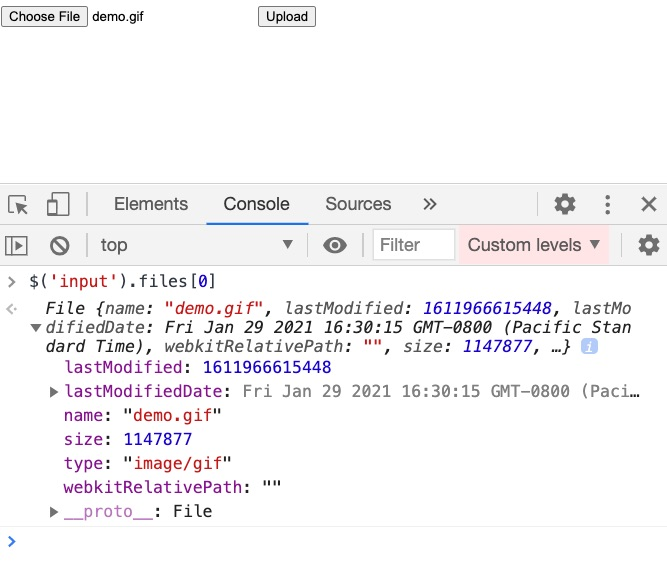

## Uploads

### Uploads

Use the `<input type="file">` element

Docs ([link](https://developer.mozilla.org/en-US/docs/Web/HTML/Element/input/file))

### Uploads

Add `enctype="multipart/form-data` to `form`, otherwise it won't work

```html
<form method="post" enctype="multipart/form-data">
  <div>
    <label for="file">Choose file to upload</label>
    <input type="file" id="file" name="file">
  </div>
  <button>Submit</button>
</form>
```

### Uploads

Control file types with `accept` attribute ([link](https://developer.mozilla.org/en-US/docs/Web/HTML/Element/input/file#limiting_accepted_file_types)):

- Comma separated
- Can be specific file types: `.docx, .pdf`
- Can be MIME types:
  - `image/*`
  - `audio/*`
  - `video/*`
- Doesn't work on some phones
    
```html
<input type="file" id="file" name="file" accept="image/*">
```

### Uploads

Allow multiple with `multiple` attribute

```html
<input type="file" id="file" name="file" multiple>
```

### File

- Get details about input: `fileEl.files[0]`
  - name
  - lastModified
  - size (in bytes)
  - type

\columnsbegin \column{.5\textwidth}



\column{.5\textwidth}
\columnsend

### File

- Limiting filesize
- Listen to `change` events on `input`
- Can make UI updates when `file.size` is above a threshold

```javascript
const oneMBInBytes = 1048576
if (file.size > oneMBInBytes) {
  // too big
} else {
  // just right
}
```

### Thumbnails

- The `File` object can be passed to `URL.createObjectURL(file)`
- Generates a `DOMString` you can assign to an `img.src`

```javascript
const image = document.createElement('img')
image.src = URL.createObjectURL(file)
document.body.appendChild(image)
```

### FileList

- Grab files and turn into array: `[...fileEl.files]`
- Then you can iterate and interact with files

### Uploading with AJAX

- Build a FormData object and `#append` files into the appropriate key
- In this example, assuming the server accepts files uploaded on the `files` field

```javascript
const data = new FormData()
;[...fileInput.files].forEach((file) => {
  data.append('files', file)
})
```

### Common mistakes

- `accept` isn't perfect not supported everywhere ([link](https://caniuse.com/input-file-accept))
- Always validate on server-side
- People upload HEIC and browsers don't know what to do with them
- Restrict file sizes probably

### Resources

- Setting up upload server ([link](https://codeforgeek.com/file-uploads-using-node-js/))
- Multer package for express file uploads ([link](https://www.npmjs.com/package/multer))

### Demo

- See http://localhost:3000/js/forms/upload-demo/upload.html
- ([Link](http://localhost:3000/js/forms/upload-demo/upload.html))

### Exercise

1. Visit http://localhost:3000/js/forms/upload.html
1. Open `src/www/forms/uploads.html` and `src/www/forms/uploads.js`.
1. Run your DB server from `src` directory: 
   1. `$ yarn db` or `$ npm run db`
