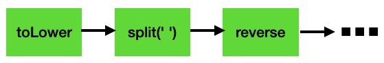

## Composition

### Composition

- We often do transformations as a sequence of actions

```javascript
const shout = str => str.toUpperCase()
const sentence = words => words.join(' ')
shout(sentence(['hello', 'world'])) // 'HELLO WORLD'
```

- First we make the array a `sentence`, and then `shout` it

### Composition

- **compose**: A way to say, "do this AFTER you do this" to some data

```javascript
f(g(x)) // => run "f" on the output from "g(x)"

const compose = (f, g) => x => f(g(x))
const shoutSentence = compose(shout, sentence)
shoutSentence(['hello', 'world']) // 'HELLO WORLD
```

### Composition

- Compose the functions
- Pass in data as a separate invocation

```javascript
compose(shout, sentence)(['foo', 'bar']) // yep
compose(shout, sentence, ['foo', 'bar']) // nope
```

### Composition

- Reads "right to left"

```javascript
R.compose(R.reverse, R.join(' '))(['hello', 'world'])
// 'dlrow olleh'

R.compose(R.join(' '), R.reverse)(['hello', 'world'])
// 'world hello'
```

### Composition

- With Ramda `compose` you can combine an arbitrary number of transformations

```javascript
const shout = str => str.toUpperCase()
const sentence = words => words.join(' ')
const reverse = xs => [...xs].reverse()
const reversedLoudSentence = compose(reverse, shout, sentence)
reversedLoudSentence(['hello', 'world']) // 'WORLD HELLO'
```

### Composition

- Commonly used in conjunction with `map`, `filter`, etc.

```javascript
const lt = curry((a, b) => a < b)
const length = x => x.length
const longerWords = R.filter(compose(lt(3), length))
longerWords(['foo', 'bar', 'waffles']) // ['waffles']
```

### Pipe

- Like `compose` but rights left-to-right
- Compose functions, pass in data as separate invocation

```javascript
const doStuff = pipe(
  x => x.toLowerCase(),
  x => x.split(' '),
  xs => xs.map(x => x.trim()),
  xs => [...xs].reverse(),
  xs => xs.filter(x => x.length > 3),
  xs => xs.join(''),
)
```

### Pipe

- Like `compose` but rights left-to-right

```javascript
const doStuff = R.pipe(
  R.toLower,
  R.split(' '),
  R.map(R.trim),
  R.reverse,
  R.filter(R.compose(R.lt(3), R.length)),
  R.join(''),
)

console.log(doStuff('dog Animal Bird cat DINOSAUR'))
// dinosaurbirdanimal
```

### Pipe



### Pipe

Imperative style:

\columnsbegin \column{.5\textwidth}

~~~ {.javascript}
const doStuff = (str) => {
  const lower = str.toLowerCase()
  const words = lower.split(' ')
  
  words.reverse()

  for (let i in words) {
    words[i] = words[i].trim()
  }
  // ...
~~~

\column{.5\textwidth}

~~~ {.javascript}
  const filtered = []

  for (let i in words) {
    if (words[i].length > 3) {
      keepers.push(words[i])
    }
  }
  
  return keepers.join('')
}
~~~

\columnsend
