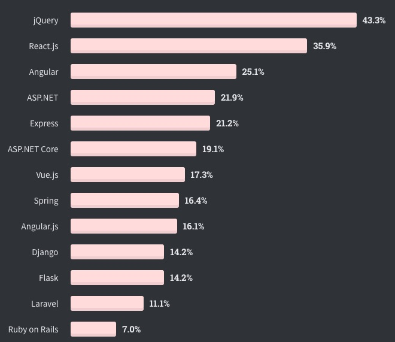
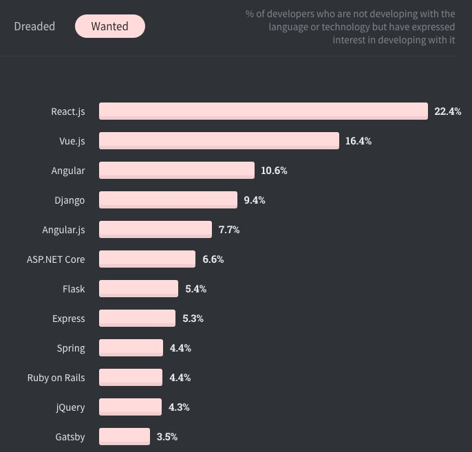
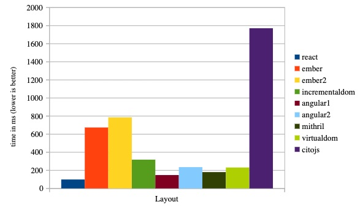

## React Basics

### What is React

**React**

A JS library for building user interfaces.

### Okay, but Really

* The (second-) most popular UI library



### Okay, but Really

But it's second because jQuery is hard to kill off; it's still the most wanted.



### Okay, but Really
 
* React **only** focuses on writing UI views in an easy, fast way
* Everything else supports creation of complex apps
  * Webpack, Babel, Redux, Apollo, axios, etc. *isn't React*, it just gets used with it a lot

### What Isn't It?

* It's not a framework (unlike Angular)
* It doesn't solve the Model or Controller parts of an MVC app
* It's not a datastore, database, server, or anything else

### What's the Big Deal Anyway

React did four revolutionary things:

* Make it easy to build composable **components** like building blocks of a UI
* Make the UI declarative as a product of **props** and **state** passed between these components
* Data flows **one direction** for performance and easier debugging
* Boost performance using a Virtual DOM to minimize changes between renders

### Sidebar

The Virtual DOM was a **Really. Big. Deal.** when it hit the scene.

Everyone was freaking out about its performance. Benchmarks galore [(link)](https://auth0.com/blog/more-benchmarks-virtual-dom-vs-angular-12-vs-mithril-js-vs-the-rest/).

 

### React: Scoffing in the Face of Tradition

React took a big stance against an old axiom of web development:

Thou Shalt Separate Concerns Into:

* HTML
* CSS
* and JavaScript


### React: Scoffing in the Face of Tradition

Instead: start with a skeleton HTML file, and JS does the rest.

```javascript
<!-- index.html -->
<div id="root"></div>

// index.js
ReactDOM.render(
  MyCoolApp, // what to render
  document.getElementById('root') // where to put it
)
```

(* the above code is not quite correct)

### One Way Data Flow

TODO 

https://miro.medium.com/max/550/1*PBgAz9U9SrkINPo-n5glgw.gif
