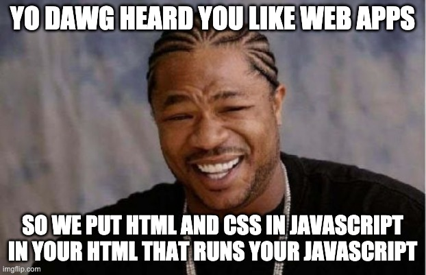

## React Basics

### What is React

**React**

A JS library for building user interfaces.

### Okay, but Really

* The (second-) most popular UI library


### Okay, but Really

* But it's second because jQuery is hard to kill off; it's still the most wanted.


### Okay, but Really
 
* React **only** focuses on writing UI views in an easy, fast way
* Everything else supports creation of complex apps
  * Webpack, Babel, Redux, Apollo, axios, etc. *isn't React*, it just gets used with it a lot

### What Isn't It?

* It's not a framework (unlike Angular)
* It doesn't solve the Model or Controller parts of an MVC app
* It's not a datastore, database, server, or anything else

### What's the Big Deal Anyway

React did five revolutionary things:

* Make it easy to write HTML in JS (called **JSX**)
* Make it easy to build composable **components** like building blocks of a UI
* Make the UI declarative as a product of **props** and **state** passed between these components
* Data flows **one direction** for performance and easier debugging
* Boost performance using a Virtual DOM to minimize changes between renders

We'll talk about most of these in more detail later.

### Sidebar

The Virtual DOM was a **Really. Big. Deal.** when it hit the scene.

Everyone was freaking out about its performance. Benchmarks galore [(link)](https://auth0.com/blog/more-benchmarks-virtual-dom-vs-angular-12-vs-mithril-js-vs-the-rest/).

 

### Sidebar

Actually, all of it was a really big deal.

No one had ever seen anything like React before and the web development community exploded.

I like to think of it as the Big Bang.

### React: Scoffing in the Face of Tradition

React took a big stance against an old axiom of web development:

Thou Shalt Separate Concerns Into: HTML, CSS, and JS

### React: Scoffing in the Face of Tradition

Instead: start with a skeleton HTML file, and JS does the rest.

```javascript
<!-- index.html -->
<div id="root"></div>

// index.js
ReactDOM.render(
  appToRender,
  document.getElementById('root') // where to put it
)
```

### Writing HTML in your JS

You can write HTML like you normally would, but in a JS file!

```javascript
// greeting.js
<h1>Hello world!</h1>
```

This syntax is called "JSX"

### Writing HTML in your JS

In this way, you can pass JSX to `ReactDOM` and it gets rendered

```javascript
// index.js

ReactDOM.render(
  <h1>Hello world</h1>,
  document.getElementById('root')
)
```

### Writing HTML in your JS



### Writing HTML in your JS

You can also store JSX in a variable.

```javascript
// index.js

const greeting = <h1>Hello world</h1>

ReactDOM.render(
  greeting,
  document.getElementById('root')
)
```

### JSX is Not Magic

JSX is *transpiled* by a tool called **Babel** into code that is actually valid JS.

```javascript
<h1 id="foo">Hello world</h1>

// becomes...
React.createElement(
  "h1", 
  { id: "foo" }, 
  "Hello world"
)
```

ReactDOM turns those values into something meaningful for the browser.

### JSX is Not Magic

Just remember, JSX **isn't magic**.

They're JS values. Always.

### File types

* `.jsx` file type === "here lies JSX"
* Some people were dogmatic about "only pure JS in `.js`"
* React changed its mind and started using `.js`
* The dogmatic people lost the argument
* Old `.jsx` files live on in perpetuity
* Amusing internet debates: [(link)](https://github.com/facebook/create-react-app/issues/87#issuecomment-234627904) and [(link)](https://github.com/airbnb/javascript/pull/985)

### A Little More JSX Magic

JSX contents are basically just strings; that's HTML.

JSX *also* allows you to stick JS values in using `{}` interpolation.

```javascript
const message = 'Hello world'
const favoriteNumber = 7
const user = { firstName: 'Andrew' }

const greeting = (
  <div>
    <h1>{message}</h1>
    <p>My favorite number is {favoriteNumber}</p>
    <p>My name is {user.firstName}</p>
  </div>
)
```

### Demo

### Exercise

* Open up `/sandbox_react` and follow the `README.md` to get it running.
* Play around with the sandbox and build a simple shopping list UI
  * Include a header with your name
  * Display today's date, e.g. `7/22/2020`
  * Create a `<ul>` element with `<li>` items showing 3 items you need to buy
* Practice inserting JS values into your JSX
  * Pull your name into an object called `user` with a `name` property
  * Pull today's date into a JS variable `date` [(hint link)](https://developer.mozilla.org/en-US/docs/Web/JavaScript/Reference/Global_Objects/Date)
    * Display the date in the format `mm/dd/YYYY`
  * CHALLENGE: Search npm for a date management package
    * Add as a dependency and use it to display the date.
    * Add dependencies with `yarn add [package]`
