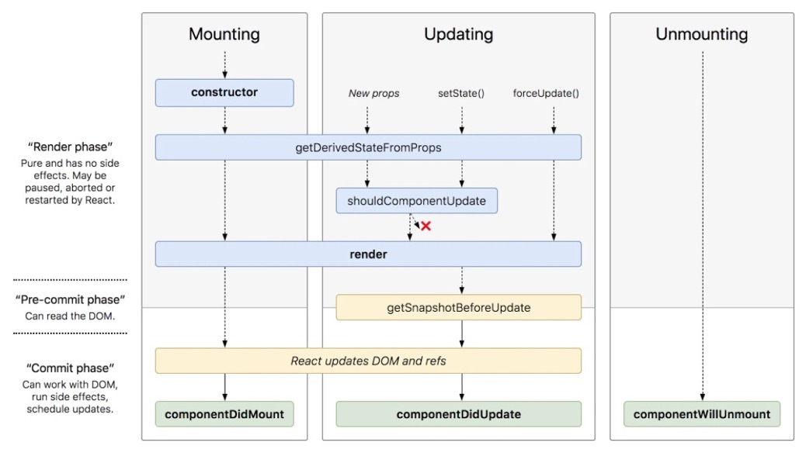
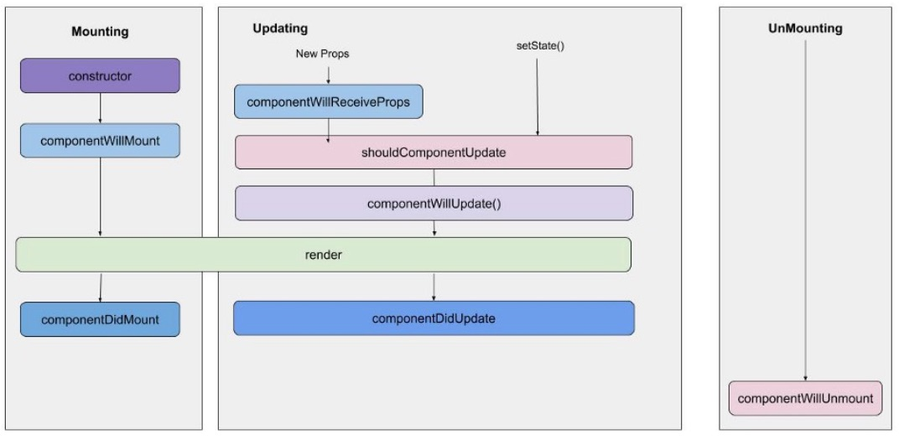

## Component Lifecycle

### The Life and Times of a React Component

* Key moments in the lifecycle of a React component
  * did mount
  * did update
  * will unmount

### The Life and Times of a React Component

* There are *many* others though



### The Life and Times of a React Component

* There were even more before:



### The Life and Times of a React Component

* But in reality, 99% of use cases will be covered by
  * `componentDidMount`
  * `componentDidUpdate`
  * `componentWillUnmount`

### componentDidMount

* Runs *after* the component is mounted to the DOM
* This matters so DOM layout calculations are correct
* Great place for side effects (e.g. timers, etc.)

```javascript
export class Countdown extends React.Component {
  componentDidMount() {
    this._timer = setInterval(this.tick, 1000)
  }
  
  tick = () => { console.log('tick') }
}
```

### componentDidUpdate

* Invoked whenever the component updates

```javascript
componentDidUpdate(prevProps, prevState) {
  // current props: this.props
  // current state: this.state
}
```

* (there's another value, `snapshot`, that's passed in, it's more advanced React stuff)

### componentDidUpdate

```javascript
export class Countdown extends React.Component {
  componentDidUpdate(prevProps, prevState) {
    if (prevProps.countFrom !== this.props.countFrom) {
      this.clearTimer() 
      this._timer = setInterval(this.tick, 1000)
    }
  }
}
```

### componentWillUnmount

* Invoked before the component unmounts from the DOM
* Clean up timers, listeners, etc.

```javascript
export class Countdown extends React.Component {
  componentDidMount() {
    this._timer = setInterval(this.tick, 1000)
  }

  componentWillUnmount() {
    clearInterval(this._timer)
  }
}
```

### componentDidCatch

* Normally, a JS error in the React tree will crash everything
* Use `componentDidCatch` to provide an "error boundary"

```javascript
class Bomb extends React.Component {
  render() { throw new Error('boom') }
}

class BombSquad extends React.Component {
  componentDidCatch(error, errorInfo) {}
  render() { return (<Bomb />) }
}
```

### Demo

[(link)](https://codesandbox.io/s/sharp-solomon-mty7y?file=/src/App.js:1234-1922)

### Exercise

[(link)](https://codesandbox.io/s/charming-golick-e1135?file=/src/App.js)
