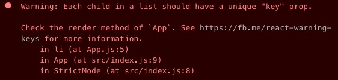

## Lists

### Static Lists

You can manually write out a few items...

```javascript
const Todos = () => (
  <ul>
    <li>Learn JS</li>
    <li>Learn React</li>
    <li>Profit!</li>
  </ul>
)
```

### Dynamic Lists

But what happens when your list is dynamic?

e.g. your `Todos` component takes a `todos` array as a prop?

```javascript
const Todos = ({ todos }) => (
  <ul>
    {/* ??? */}
  </ul>
)
```

### Dynamic Lists

Remember: JSX are simply JS *values*.

```javascript
const Todos = ({ todos }) => {
  const todo1 = <li>Learn JS</li>
  const todo2 = <li>Learn React</li>
  const todo3 = <li>Profit</li>
  return (
    <ul>
      {[todo1, todo2, todo3]}
    </ul>
  )
}
```

### Dynamic Lists

What do we use to transform an array of elements

into another array with a 1:1 transformation?

### Dynamic Lists

`Array#map`

```javascript
const Todos = ({ todos }) => {
  const todosJsx = todos.map((todo) => (
    <li>{todo}</li>
  ))
  
  return (
    <ul>
      {todosJsx}
    </ul>
  )
}
```

### Dynamic Lists

Or inline it...

```javascript
const Todos = ({ todos }) => {
  return (
    <ul>
      {todos.map(todo => (
        <li>{todo}</li>
      ))}
    </ul>
  )
}
```

### The Key to the Kingdom

When you do this in the browser, you'll get:



### The Key to the Kingdom

* `key` is used by React to identify nodes between renders
* It allows React to reuse DOM nodes

\columnsbegin
\column{.5\textwidth}

```javascript
<ul>
  <li key="apples">Apples</li>
  <li key="bananas">Bananas</li>
</ul>
```

\column{.5\textwidth}

```javascript
<ul>
  <li key="clems">Clementines</li>
  <li key="apples">Apples</li>
  <li key="bananas">Bananas</li>
</ul>
```

\columnsend

The `apples` and `bananas` elements will be reused

### The Key to the Kingdom

* Use something unique, like an ID
* Only needs to be locally unique within that list

```javascript
<ul>
  <li key="apples">Apples</li>
  <li key="bananas">Bananas</li>
</ul>
<ul>
  <li key="apples">Apples</li>
  <li key="berries">Raspberries</li>
</ul>
```

### Danger Zone: Index as the Key

You *can* use the element index **if** your array won't change.

```javascript
<ul>
  {arrayThatDefinitelyWontChange.map((item, i) => (
    <li key={i}>{item}</li>
  ))}
</ul>
```

### Danger Zone: Index as the Key

Using the index can have performance downsides

[and unexpected behavior](https://codesandbox.io/s/practical-fast-mmmw6?file=/src/App.js) with forms
