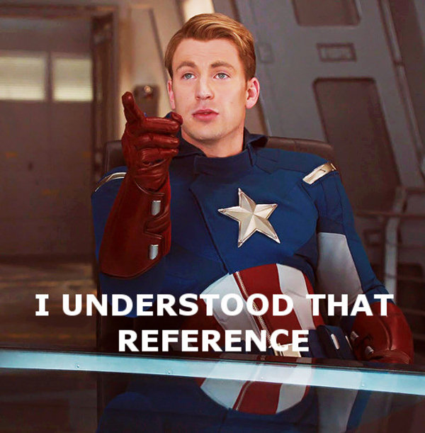

## Refs

### I Get That Reference

* Generally parents don't talk directly to children or DOM elements
* Data simply flows downward via props and state
* But sometimes you do need to **reference** an element
* E.g. `focus()` on an `<input>`

### I Get That Reference

[](https://www.youtube.com/watch?v=mwULoKgH7rw&feature=youtu.be&t=258)

### DOM Refs

* First, create the reference:

```javascript
class App {
  myRef = React.createRef()
}
```

* Then, give it to a DOM element:

```javascript
render() {
  return (<input type="text" ref={this.myRef} />)
}
```

### DOM Refs

* Lastly, you can get the ref via the `.current` attribute

```javascript
focus = () => {
  this.myRef.current.focus()
}
```

(This is using the `focus` method on the HTMLInputElement API [(link)](https://developer.mozilla.org/en-US/docs/Web/API/HTMLInputElement))

### DOM Refs

* Whole code:

```javascript
class CustomTextInput extends React.Component {
  textInput = React.createRef()

  focusTextInput = () => {
    this.textInput.current.focus()
  }

  render() {
    return (
      <div>
        <input type="text" ref={this.textInput} />
        <button onClick={this.focusTextInput}>
          Focus the text input
        </button>
      </div>
    )
  }
}
``` 

### Component Refs

* You can also reference class components:

```javascript
class AutoFocusTextInput extends React.Component {
  textComponent = React.createRef()

  componentDidMount() {
    this.textComponent.current.focusTextInput()
  }

  render() {
    return (
      <CustomTextInput ref={this.textComponent} />
    )
  }
}
```

### Ref Hooks

* Hooks also gave function components the power of Refs
* (Noticing a theme with Hooks?)


### Component Refs

* You **cannot** reference function components in the same way

```javascript
const CustomTextFn = () => { /* ... */ }

class App extends React.Component {
  render() {
    // nope.
    return (<CustomTextFn ref={this.myRef} />)
  }
}
```

That requires using `forwardRef` and `useImperativeHandle`.
                    
Docs: [(link)](https://reactjs.org/docs/hooks-reference.html#useimperativehandle)


### Ref Hooks

* Refs are similar inside of function components with `useRef`

```javascript
const CustomTextFn = () => {
  const textInput = useRef()

  const focusTextInput = () => {
    textInput.current.focus()
  }
  
  return (
    <div>
      <input type="text" ref={textInput} />
      <button onClick={focusTextInput}>
        Focus the text input
      </button>
    </div>
  )
}
```

### Imperative React

* Now you might be thinking:
  * I can use `ref`s to ask child components about their state!

```javascript
class SelfManagedText extends React.Component {
  state = { value: '' }
  handleChange = (e) => {
    this.setState({ value: e.target.value })
  }
  value = () => this.state.value

  render() {
    return <input onChange={this.handleChange} />
  }
}
```

### Imperative React

* And then use `.value()` when you need to know the state:

```javascript
export class App extends React.Component {
  input = React.createRef()
  submit = () => {
    console.log('Value', this.input.current.value())
  }

  render() {
    return (
      <div>
        <SelfManagedText ref={this.input} />
        <button onClick={this.submit}>Submit</button>
      </div>
    )
  }
}
```

### Imperative React

* Now you don't have to manage state all the time!

[(link)](https://media.giphy.com/media/RLjgicu9I6gjS/giphy.gif)

### Imperative React

* But how do you disable the button while the input is empty?

[(link)](https://media.giphy.com/media/WpaVhEcp3Qo2TjwyI1/giphy.gif)

### Imperative React

* 99% of the time, you *do not* want to do this.
* You *can* make it work, but it sucks and is awkward
  * Trust me, I tried. It a path paved with sadness.
* Same goes for something like a Modal:
  * Don't call `open()` on it, pass an `isOpen` prop

### Demo

[(link)](https://codesandbox.io/s/exciting-morse-drfkh?file=/src/App.js)

### Exercise

**Exercise 1**: [(link)](https://codesandbox.io/s/refs-6c4og)
